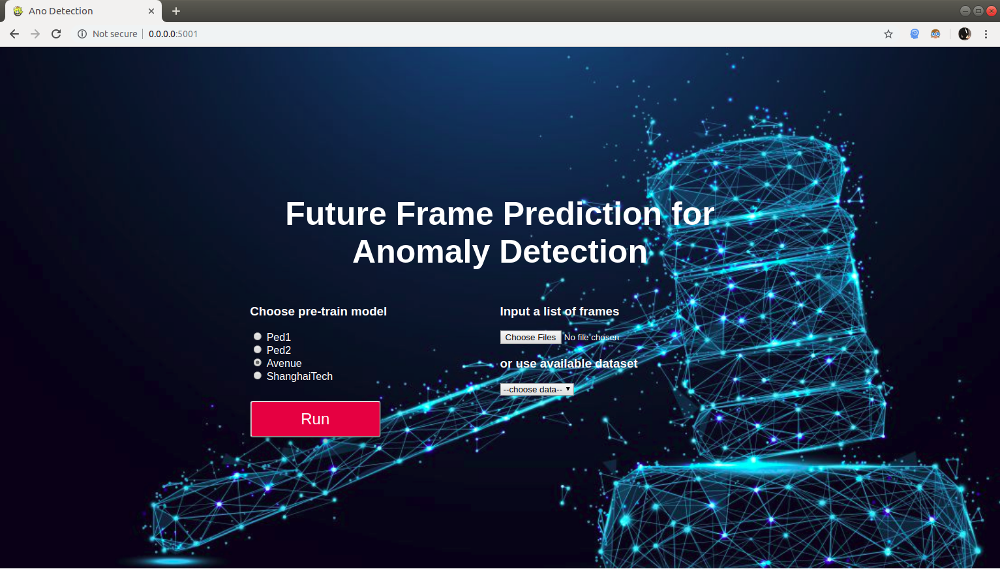

# to run 2 flask app dual
```shell
$ export FLASK_APP=appGUI.py
$ flask run --host 0.0.0.0 --port 5001
```
# ano-webGUI
this is GUI front-end of our repo [futureframes for abnormal detection](https://github.com/deathvn/anopred-futureframe.git)   
to run this GUI app, follow below comand.
```shel
python appGUI.py
```
open the link appear on browser, the home screen will be like this:  

